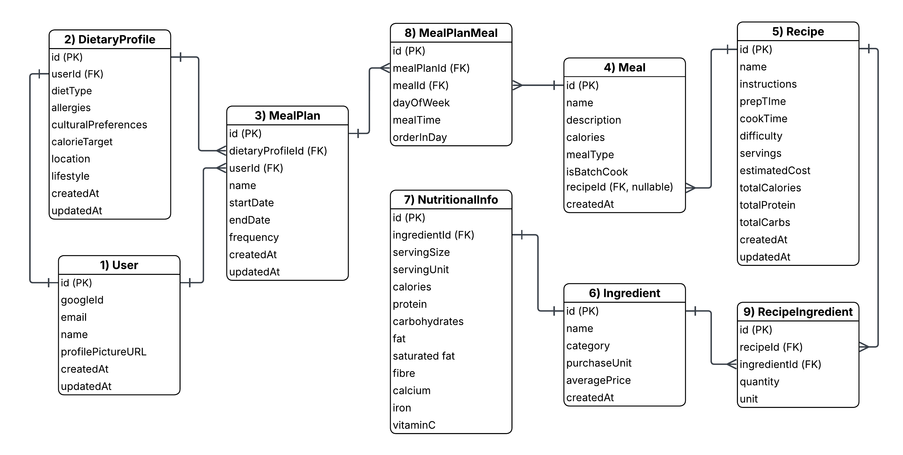

# NutriMC Database Design Document

## Overview
NutriMC is a meal planning application that integrates with Anthropic's Model Context Protocol (MCP) to provide intelligent,
personalised meal planning based on user dietary preferences and nutritional requirements.

## Design Principles
- **Normalisation:** 3NF to reduce data redundancy
- **Flexibility:** Support multiple diet types and preferences
- **Scalability:** Designed for future growth and feature additions
- **Audit Trail:** Timestamps for key entities
- **Data Integrity:** Foreign key constraints and validation

## Entity Relationship Diagram

*Figure 1: Updated ERD diagram for the Nutri Management Component.*

## Entities

### 1) User
Primary entity representing application users.

**Attributes**
- `id`: Unique identifier
- `googleId`: OAuth identifier from Google Sign-In
- `email`: User email address (unique)
- `name`: User display name
- `profilePictureUrl`: Avatar from Google
- `createdAt`: Account creation timestamp
- `updatedAt`: Last modification timestamp

**Relationships**
- One-to-One with DietaryProfile
- One-to-Many with MealPlan

**Business Rules**
- Email must be unique
- Google OAuth is the only authentication method
- Users can have one active dietary profile

### 2) DietaryProfile
Stores user dietary preferences, restrictions and goals 

**Attributes**
- `id`(PK): Unique identifier
- `userId`(FK): Reference to User
- `dietType`: ENUM (OMNIVORE, VEGETARIAN, VEGAN, PESCATARIAN, KETO, PALEO, MEDITERRANEAN)
- `allergies`: JSON array of allergen strings
- `culturalPreferences`: JSON array (halal, kosher, etc)
- `calorieTarget`: Daily calorie goal
- `location` User location for regional recipes
- `lifestyle` Lifestyle description
- `createdAt`: Profile creation timestamp
- `updatedAt`: Last modification timestamp

**Relationships**
- One-to-One with User (one active profile per user)
- One-to-Many with MealPlan

**Business Rules**
- One active profile per user
- Diet type is required
- Calorie target must be positive

### 3) MealPlan
Represents a user's planned meals over a time period.

**Attributes**
- `id`(PK): Unique identifier
- `userId`(FK): Reference to User
- `dietaryProfileId`(FK): Dietary profile used for generation
- `name`: Descriptive name (e.g., "Week of Jan 15)
- `startDate`: Plan start date
- `endDate`: Plan end date
- `frequency`: ENUM (WEEKLY, MONTHLY, CUSTOM)
- `createdAt`: Plan creation timestamp
- `updatedAt`: Last modification timestamp

**Relationships**
- Many-to-One with User
- Many to One with DietaryProfile
- Many-to-Many with Meal (via MealPlanMeal)

**Business Rules**
- End date must be after start date
- Must reference an active dietary profile

### 4) Meal
Represents a single meal (with or without a recipe).

**Attributes**
- `id`(PK): Unique identifier
- `name`: Meal name
- `description`: Optional description
- `calories`: estimated calories
- `mealType`: ENUM (HOMEMADE, TAKEOUT, LEFTOVER, MEAL_PREP)
- `isBatchCook`: Boolean flag
- `recipeId`(FK, nullable): Optional reference to Recipe
- `createdAt`: Meal creation timestamp

**Relationships**
- Many-to-Many with MealPlan (via MealPlanMeal)
- Many-to-One with Recipe (optional)

**Business Rules**
- Meal can exist without a recipe (takeout, leftovers)
- Calories must be a non-negative

### 5) Recipe
Cooking instruction and metadata for preparing a meal.

**Attributes**
- `id`(PK): Unique identifier
- `name`: Recipe name
- `instructions`: Cooking steps
- `prepTime`: Cooking time (minutes)
- `cookTime`: Cooking time (minutes)
- `difficulty`: ENUM (EASY, MEDIUM, HARD)
- `servings`: Number of servings
- `estimatedCost`: Cost estimate
- `totalCalories`: Calculated form ingredients
- `totalProtein`: Calculated form ingredients
- `totalCarbs`: Calculated form ingredients
- `createdAt`: Recipe creation timestamp
- `updatedAt`: Last modification timestamp

**Relationships**
- One-to-Many with Meal
- Many-to-Many with Ingredient (via RecipeIngredient)

**Business Rules**
- Times must be positive
- Servings must be at least 1
- Nutritional totals are calculated, not directly editable

### 6) Ingredient
Raw food items used in recipes

**Attributes**
- `id`(PK): Unique identifier
- `name`: Ingredient name
- `category`: ENUM (VEGETABLE, PROTEIN, GRAIN, DAIRY, SPICE, etc.)
- `purchaseUnit`: How ingredient is purchased (kg, lbs, dozen, liter)
- `averagePrice`: Average cost per unit
- `createdAt`: Ingredient creation timestamp

**Relationships**
- Many-to-Many with Recipe (via RecipeIngredient)
- One-to-One with NutritionalInfo

**Business Rules**
- Ingredient names should be unique
- Price must be non-negative

### 7) NutritionalInfo
Nutritional data for ingredients (per servings).

**Attributes**
- `id`(PK): Unique identifier
- `ingredientId`(FK): Reference to Ingredient
- `servingSize`: Standard serving size
- `servingUnit`: Unit of measurement
- `calories`: Calories per serving
- `protein`: Grams of protein
- `carbohydrates`: Grams of carbs
- `fat`: Grams of fat
- `saturatedFat`: Grams of saturated fat
- `fiber`: Grams of fiber
- `calcium`: Milligrams
- `iron`: Milligrams
- `vitaminC`: Milligrams

**Relationships**
- One-to-One with Ingredient

**Business Rules**
- All nutritional values must be non-negative
- Serving size must be positive

### 8) MealPlanMeal (Junction Table)
Links meals to meal plans with scheduling information.

**Attributes**
- `id`(PK): Unique identifier
- `mealPlanId`(FK): Reference to MealPlan
- `mealId`(FK): Reference to Meal
- `dayOfWeek`: ENUM (MONDAY-SUNDAY)
- `mealTime`: ENUM (BREAKFAST, LUNCH, DINNER, SNACK)
- `orderInDay`: Integer for multiple meals at same time

**Relationships**
- Many-to-One with MealPlan
- Many-to-One with Meal

**Business Rules**
- orderInDay must be positive
- Unique constraint on (mealPlanId, dayOfWeek, mealTime, orderInDay)

### 9) RecipeIngredient (Junction Table)
Links ingredient to recipes with quantities.

**Attributes**
- `id`(PK): Unique identifier
- `recipeId`(FK): Reference to Recipe
- `ingredientId`(FK): Reference to Ingredient
- `quantity`: Amount needed
- `unit`: Measurement unit (grams, cups, tablespoons, pieces)

**Relationships**
- Many-to-One with Recipe
- Many-to-One with Ingredient

**Business Rules**
- Quantity must be positive
- Unit should match common cooking measurements

## Database Indexes

**Performance Optimization:**

Researching

## Future Enhancements
- Shopping list generation from meal plans
- Recipe rating and reviews
- Social features (share meal plans)
- AI-powered meal suggestions via MCP
- Nutrition goal tracking over time
- Recipe image uploads

## Change Log
- **2025-10-06**: Initial database design
- **2025-10-06**: Added Google OAuth support
- **2025-10-06**: Refined dietType to ENUM